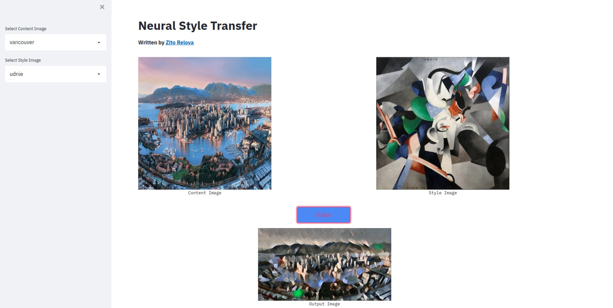

# Neural Style Transfer with Pytorch

This is an implementation of the Neural Style Transfer algorithm using Pytorch.

Website: https://share.streamlit.io/zitorelova/neural-style-app/main/style_transfer/main.py

### Stylize an image

In neural style transfer, a neural network (VGG16) takes one image, the "content image" (usually a photo), and "draws" it in the "style" of another image (usually a painting).

The neural networks used for styling images are implemented in [Pytorch](https://pytorch.org/) while the application itself is written using [Streamlit](https://streamlit.io/).

For more details on the training code and training your own style models, refer to [this](https://github.com/zitorelova/neural-style-transfer) repository.

## Running the application locally

To run the application locally, install the required dependencies by running

`pip install -r requirements.txt`

Once the requirements have been installed you can run the application using

`streamlit run style-transfer/main.py`

You can then go to `http://localhost:8501` to view the running application.

## References

- [A Neural Algorithm of Artistic Style](https://arxiv.org/abs/1508.06576)
